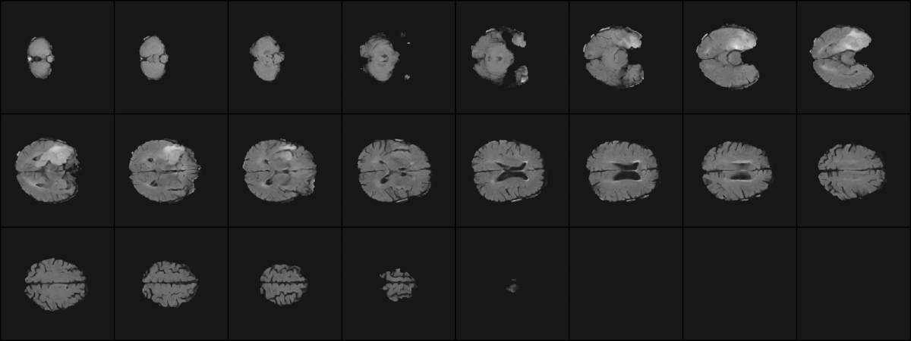
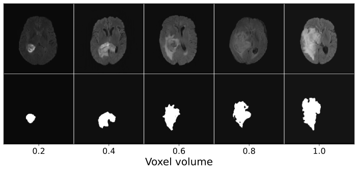

# synthesis-with-slice-based-latent-diffusion-model

Official code base repository for "3D MRI Synthesis with Slice-Based Latent Diffusion Models: Improving Tumor Segmentation Tasks in Data-Scarce Regimes"
- **Accepted at ISBI2024**
- Arxiv paper will be available soon.  

This repository is based on openai/improved-diffusion ([Link](https://github.com/openai/guided-diffusion)) official repository and medfusion public repository ([Link](https://github.com/mueller-franzes/medfusion)).  
The code is modified to fit the needs of the project.

## Abstract
Despite the increasing use of deep learning in medical image segmentation, the limited availability of annotated training data remains a major challenge due to the time-consuming data acquisition and privacy regulations. In the context of segmentation tasks, providing both medical images and their corresponding target masks is essential. However, conventional data augmentation approaches mainly focus on image synthesis. In this study, we propose a novel slice-based latent diffusion architecture designed to address the complexities of volumetric data generation in a slice-by-slice fashion. This approach extends the joint distribution modeling of medical images and their associated masks, allowing a simultaneous generation of both under data-scarce regimes. Our approach mitigates the computational complexity and memory expensiveness typically associated with diffusion models. Furthermore, our architecture can be conditioned by tumor characteristics, including size, shape, and relative position, thereby providing a diverse range of tumor variations. Experiments on a segmentation task using the BRATS2022 confirm the effectiveness of the synthesized volumes and masks for data augmentation.

  

  Example of MRIs synthesized with varying tumor Sizes, ranging from 0.0 to 1.0. The tumor position is fixed.

